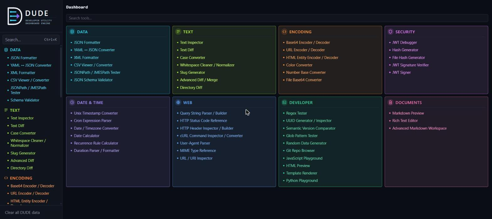
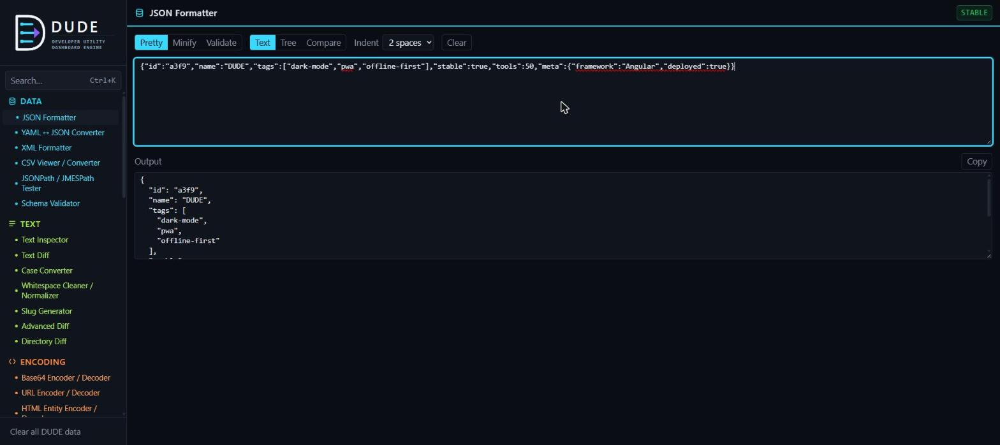

<p align="center">
  
</p>

# DUDE — Developer Utility Dashboard Engine

[](https://github.com/arahman200165/DUDE/actions/workflows/deploy.yml)
[](https://arahman200165.github.io/DUDE/)
[](LICENSE)

A dense, dark-mode-only, installable Progressive Web App that consolidates the small developer utilities you'd otherwise Google one at a time — JSON formatting, regex testing, JWT decoding, hashing, diffing, and more — into a single fast, offline-capable, keyboard-driven deck.

**[→ Open the live app](https://arahman200165.github.io/DUDE/)**

---

## What is DUDE

DUDE is not a race to ship the most tools. It's a framework built to make adding **tool 30, 31, or 40** routine instead of architectural work — a new simple utility with existing transformation logic can be added in **under 30 minutes**, without touching navigation, routing, search, the command palette, persistence, or the PWA layer. Milestone 10's timed proof (see [`ADDING_A_TOOL.md`](ADDING_A_TOOL.md)) added a full tool, tests included, in **2 minutes 50 seconds** — a claim then validated at scale across Milestone 11's 8-tool batch, Milestone 12's structured-data batch, and Milestone 13's web/API batch, which added two new shared UI primitives (`app-copy-button`, `app-key-value-editor`) without touching the shell.

Everything runs client-side. There's no backend, no accounts, no telemetry — your data never leaves the browser unless a tool explicitly tells you otherwise.

- **Local-first** — every current tool works fully offline after the first load.
- **Dense, not decorative** — bold, functional color-coding by category and status, built for daily use, not for demos.
- **Framework-first** — the registry, shell, persistence, and worker layers were built before the tools, so new tools are cheap and safe to add.

## Screenshots

| Deck | JSON Formatter |
| --- | --- |
|  |  |

## Tools

34 tools ship today, each self-registered in [`tool-definitions.ts`](src/app/core/registry/tool-definitions.ts) — nothing about the shell knows any tool by name.

| Tool | Category | What it does |
| --- | --- | --- |
| [JSON Formatter](https://arahman200165.github.io/DUDE/tools/json) | Data | Validate, pretty-print, and minify JSON, with worker execution above 50KB and a collapsible structural Tree view. |
| [YAML ↔ JSON Converter](https://arahman200165.github.io/DUDE/tools/yaml-json) | Data | Converts between YAML and JSON in either direction. |
| [XML Formatter](https://arahman200165.github.io/DUDE/tools/xml-formatter) | Data | Validates, formats, and minifies XML. |
| [CSV Viewer / Converter](https://arahman200165.github.io/DUDE/tools/csv-viewer) | Data | Views CSV as a dense table, and converts between CSV and JSON. |
| [JSONPath / JMESPath Tester](https://arahman200165.github.io/DUDE/tools/json-query) | Data | Queries JSON with a JSONPath or JMESPath expression. |
| [Text Inspector](https://arahman200165.github.io/DUDE/tools/text-inspector) | Text | Character, word, line, and UTF-8 byte metrics for any text, including selections. |
| [Text Diff](https://arahman200165.github.io/DUDE/tools/diff) | Text | Line-oriented diff between two blocks of text, computed in a worker. |
| [Case Converter](https://arahman200165.github.io/DUDE/tools/case-converter) | Text | Converts text between camelCase, snake_case, kebab-case, Title Case, and more. |
| [Whitespace Cleaner / Normalizer](https://arahman200165.github.io/DUDE/tools/whitespace-cleaner) | Text | Trims, collapses, and normalizes whitespace, line endings, and invisible characters. |
| [Slug Generator](https://arahman200165.github.io/DUDE/tools/slug-generator) | Text | Turns a title into a URL-friendly slug, with transliteration and length control. |
| [Base64 Encoder / Decoder](https://arahman200165.github.io/DUDE/tools/base64) | Encoding | UTF-8-safe text ↔ Base64 conversion. |
| [URL Encoder / Decoder](https://arahman200165.github.io/DUDE/tools/url-encode) | Encoding | Percent-encodes or decodes text as a URL component or a full URI. |
| [HTML Entity Encoder / Decoder](https://arahman200165.github.io/DUDE/tools/html-entities) | Encoding | Encodes text as HTML entities, or decodes named/numeric entities back to text. |
| [Color Converter](https://arahman200165.github.io/DUDE/tools/color-converter) | Encoding | Converts between HEX, RGB, HSL, HSV, CMYK, and named CSS colors. |
| [Number Base Converter](https://arahman200165.github.io/DUDE/tools/number-base) | Encoding | Converts whole numbers between binary, octal, decimal, hex, or any base 2–36. |
| [JWT Debugger](https://arahman200165.github.io/DUDE/tools/jwt) | Security | Decodes a JWT's header and payload — never persisted, never verifies signatures. |
| [Hash Generator](https://arahman200165.github.io/DUDE/tools/hash) | Security | MD5, SHA-1, SHA-256, SHA-384, and SHA-512 digests, computed in a worker. |
| [Unix Timestamp Converter](https://arahman200165.github.io/DUDE/tools/unix-timestamp) | Date & Time | Converts between Unix timestamps and human-readable local/UTC dates. |
| [Cron Expression Parser](https://arahman200165.github.io/DUDE/tools/cron) | Date & Time | Parses a cron expression into a human-readable schedule and previews its next run times. |
| [Date / Timezone Converter](https://arahman200165.github.io/DUDE/tools/timezone-converter) | Date & Time | Converts a moment in time across a chosen set of IANA timezones, as a multi-zone world clock. |
| [Duration Parser / Formatter](https://arahman200165.github.io/DUDE/tools/duration-formatter) | Date & Time | Parses a human or ISO 8601 duration and shows it in every representation at once. |
| [Query String Parser / Builder](https://arahman200165.github.io/DUDE/tools/query-string) | Web | Parses a query string or URL into key/value pairs, or builds one from scratch. |
| [HTTP Status Code Reference](https://arahman200165.github.io/DUDE/tools/http-status) | Web | Searchable reference of IANA-registered HTTP status codes, grouped by class. |
| [HTTP Header Inspector / Builder](https://arahman200165.github.io/DUDE/tools/http-header-inspector) | Web | Inspects pasted HTTP headers as key/value pairs, or builds a header set from scratch. |
| [cURL Command Inspector / Converter](https://arahman200165.github.io/DUDE/tools/curl-converter) | Web | Parses a curl command into its parts, builds one interactively, and exports it as code in 8 languages. |
| [User-Agent Parser](https://arahman200165.github.io/DUDE/tools/user-agent) | Web | Breaks a User-Agent string down into browser, engine, OS, and device details. |
| [MIME Type Reference](https://arahman200165.github.io/DUDE/tools/mime-types) | Web | Searchable reference of common IANA-registered MIME types with file-extension lookups. |
| [URL / URI Inspector](https://arahman200165.github.io/DUDE/tools/url-inspector) | Web | Breaks a URL down into scheme, host, path, query, and fragment — and edits any part, round-tripping back to a full URL. |
| [Regex Tester](https://arahman200165.github.io/DUDE/tools/regex) | Developer | Tests a pattern against text with match/capture-group detail, in a worker. |
| [UUID Generator / Inspector](https://arahman200165.github.io/DUDE/tools/uuid) | Developer | Generates RFC 4122 v4 UUIDs and inspects an existing UUID's version/variant. |
| [Semantic Version Comparator](https://arahman200165.github.io/DUDE/tools/semver-comparator) | Developer | Compares, sorts, and range-checks versions against the Semantic Versioning spec. |
| [Glob Pattern Tester](https://arahman200165.github.io/DUDE/tools/glob-tester) | Developer | Tests a glob pattern against a list of sample paths. |
| [Random Data Generator](https://arahman200165.github.io/DUDE/tools/random-data-generator) | Developer | Generates realistic fake data — names, addresses, internet, finance, and more — as a table, CSV, or JSON. |
| [Markdown Preview](https://arahman200165.github.io/DUDE/tools/markdown) | Documents | Side-by-side Markdown editor with a sanitized, live-rendered preview. |

## Architecture

The shell is generated entirely from tool metadata — no file under `src/app/shell/` or `src/app/core/` contains a single hard-coded tool ID. Adding a tool means creating a folder under `src/app/tools/` and adding one entry to the registry; the sidebar, deck, search, command palette, and routes all update automatically.

```
src/app/
  core/
    registry/      tool metadata, the registry service, search, route generation
    persistence/    per-tool session/local/none storage policy
    workers/        the shared Worker request/result/cancel contract
    connectivity/   online/offline signal, update-available detection
    routing/        the one root route table (lazy-loads every tool)
  shell/            sidebar, deck, command palette, root layout
  shared/           tool-shell frame, error panel, split-pane, tree-view, data-table, copy-button, key-value-editor, and other cross-tool primitives
  tools/            one folder per tool — pure logic + component, isolated from every other tool
```

Key design choices:

- **Per-tool persistence policy** (`none` / `session` / `local`) — sensitive tools like the JWT Debugger persist nothing by default; UI preferences like indent size persist locally.
- **Shared worker layer** — heavy or unbounded work (hashing, regex, diffing, large JSON) can opt into a Web Worker without each tool reinventing message-passing, cancellation, or error handling.
- **Failure isolation** — a worker crash or a tool bug stays inside that tool's route; the sidebar and navigation keep working.
- **Lazy loading** — every tool is a separate `loadComponent` chunk, so visiting one tool never downloads another's code or libraries.

See [`ADDING_A_TOOL.md`](ADDING_A_TOOL.md) for the full, step-by-step guide to adding a new tool, written against the real `base64` tool as a worked example.

## Tech stack

Angular 22 (standalone components, signals) · Tailwind CSS v4 · Vitest · Playwright · `@angular/service-worker` · TypeScript

Library-forward by design — Markdown rendering, diffing, sanitization, color-space math, slug transliteration, structured-data parsing, cron scheduling, and User-Agent parsing all lean on mature libraries (`markdown-it`, `diff-match-patch`, `dompurify`, `colord`, `@sindresorhus/slugify`, `js-yaml`, `fast-xml-parser`, `papaparse`, `jsonpath-plus`, `jmespath`, `cron-parser`, `cronstrue`, `ua-parser-js`) rather than reimplementing them.

## Getting started

```bash
git clone https://github.com/arahman200165/DUDE.git
cd DUDE
npm install
npm start
```

Open `http://localhost:4200/`. The app reloads automatically as you edit source files.

## Building

```bash
npm run build
```

Production output goes to `dist/dude/browser`, optimized and with the service worker enabled.

## Testing

```bash
npm test         # Vitest unit tests — registry, persistence, worker wrapper, tool transforms, keyboard nav
npm run test:e2e # Playwright, against a real production build: SPA-fallback routing + PWA offline behavior
```

Testing follows a "protect the framework, not chase coverage" posture: every tool's pure transform logic is unit-tested, and the two Playwright specs specifically prove the two things a unit test can't — a deep tool link resolving correctly on GitHub Pages, and the cached shell surviving a real offline reload.

## Deployment

Every push to `master` runs [`.github/workflows/deploy.yml`](.github/workflows/deploy.yml): install, test, build, then publish `dist/dude/browser` to GitHub Pages via `actions/deploy-pages`.

Two details make clean, bookmarkable routes work correctly on GitHub Pages' static hosting:

- **Base path** — the production build is configured with `baseHref: '/DUDE/'` (see `angular.json`) to match the project-page URL structure.
- **SPA fallback** — GitHub Pages has no server-side rewrite, so a direct hit or refresh on e.g. `/DUDE/tools/json` would 404. [`public/404.html`](public/404.html) catches that 404 and redirects into `index.html` with the original path encoded in the query string, which `index.html` then decodes and hands to the Angular router before it boots. This is exercised end-to-end by `e2e/production-direct-route.spec.ts` against the real built output.

Live site: **[arahman200165.github.io/DUDE](https://arahman200165.github.io/DUDE/)**

## PWA & Offline

DUDE is an installable Progressive Web App with an offline-capable app shell.

**What's cached:** after the first successful page load over a network connection, the Angular service worker (`@angular/service-worker`) caches the app shell (HTML, JS, CSS bundles) and static assets (icons, manifest). Each tool's code is fetched and cached the first time you navigate to it.

**What works offline:** once cached, the deck shell and any previously-visited local tool (e.g. JSON Formatter) launch and function fully offline — no network round-trip required. Tools that declare a network requirement (none currently do) show a compact "Offline" badge in their header when the app has no connectivity, and never block the rest of the app from working.

**What does NOT work offline:** a tool (or the app itself) that has never been successfully loaded at least once while online cannot be launched offline — the service worker can only serve what it has previously cached.

**Update strategy:** DUDE checks for a new version whenever the page is (re)loaded, and additionally polls every 6 hours in the background so a tab left open for a long session still notices a new deployment. When a new version is ready, a small "Update available" prompt appears in the top-right corner of the shell. Updates are never applied silently or automatically — click "Reload" to activate the new version and refresh the page. Until you do, you keep using the version you loaded.

**Testing offline behavior locally:** the service worker is only active in production builds (`ng build`), not `ng serve`. To test:

```bash
npm run build
npx http-server dist/dude/browser -p 8080
```

Then open `http://localhost:8080`, let it load once, and use your browser DevTools' Network tab "Offline" toggle to verify the shell and any already-visited tool still work.

## Adding a new tool

Read [`ADDING_A_TOOL.md`](ADDING_A_TOOL.md) — it walks through creating a tool folder, defining metadata, choosing a persistence/worker/network policy, and verifying discovery, using the real `base64` tool as the worked example. If following it ever requires editing the shell, routing, or a core service, that's an architecture bug, not something to work around.

## License

[MIT](LICENSE) © arahman200165
